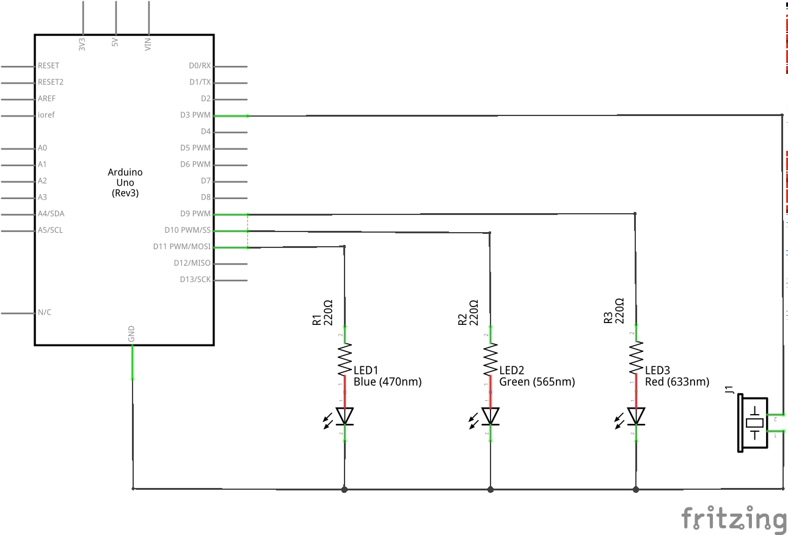
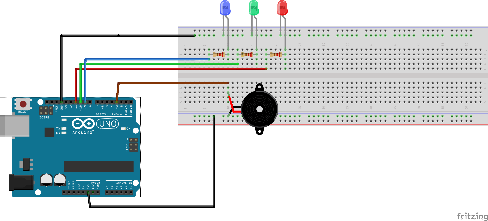

#ttymidi buzz tone

This simple project shows how to handle midi signals that come in from the usb port using ttymidi, so we don't need a midi shield. 

The midi note signals are used to index a table of frequencies so that simple tunes can be played using a piezo buzzer. In addition, and array of LEDs is used to illustrate ways in which midi signals can be used. 

#Circuit

*see fritzling file MidiBuzzer.fzz*

